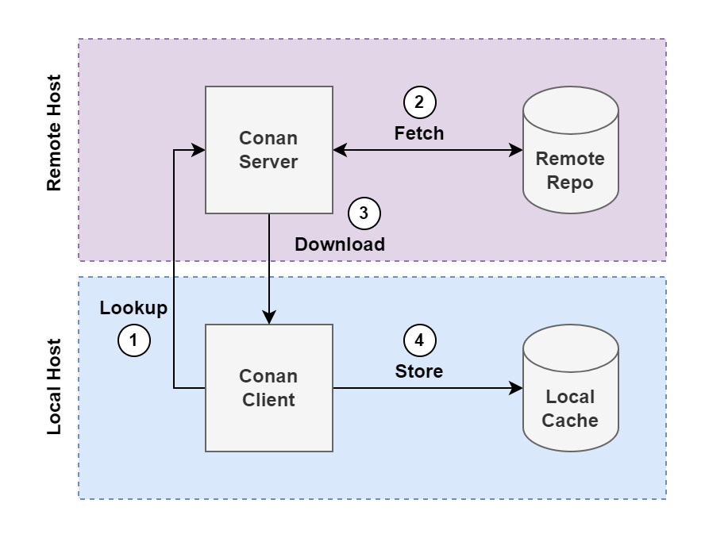

# Introducing Conan

No matter what language you write your software in, it's likely that you will
run into a situation where you want to reach for code produced by someone else.
Code reuse helps improve software maintainability and development agility. While
there are many ways to share and reuse code across multiple projects, the most
effective is versioned package management.

[Conan](https://conan.io) is a package manager for C and C++. It consists of a
server, which hosts a remote repository of packages, and a client, which makes
requests to the repository to install packages so we can use them. Conan works
for libraries and applications and can utilize any environment, build system,
and OS. This flexibility has helped Conan become an industry-wide approach to
tackling the challenging problem of package management for C++ projects, old and
new.

## A Little History

Conan was originally created by Luis Martínez de Bartolomé Izquierdo and Diego
Rodríguez-Losada in 2015. The two engineers, based in Madrid, Spain, founded the
startup Conan.io in 2016. In November of that same year,
[JFrog](https://jfrog.com/) acquired their company. JFrog remains the primary
owner and maintainer of the Conan package manager to this day.

> Conan v1 was in stable use until early 2023 when Conan v2 came out. Conan v2
> contains several major updates that improve the overall tool experience. I
> will assume we are using Conan v2 throughout the remainder of the book.

## Conan's Approach to Package Management

Most production-ready programming languages have a mechanism for transforming
source code written by developers into efficiently packaged artifacts that can
be consumed by the operating system or language runtime. Package managers
typically deal with these artifacts rather than the source code directly. Since
projects develop in C and C++ produced binary artifacts, this poses a
particularly interesting challenge for their package manager.

### Dealing with Binary Artifacts

The challenge with binary artifacts is that they are operating system and
configuration specific. This makes managing them more difficult than artifacts
that are cross-platform by nature.

Let's take packages created for the Python programming language as an example.
Unlike many Python packages, which just need the Python runtime installed and
then can run on any host operating system, you can't run a native binary
artifact built on an OS like Windows on an OS like Linux. To make matters even
more challenging, even if the host OS is the same, things like the compiler, the
compiler version, and the compile-time options used to build the artifact all
play a part in the binary compatability of two C/C++ packages.

### Describing Binary Artifacts

Conan takes a descriptive approach to dealing with this complexity. With Conan,
C/C++ library and application developers create **recipes** that describe how
the artifact is built. Conan uses the options, settings, and requirements
defined in these recipes to determine whether or not two packages are binary
compatible. All of this information is contained inside of a hash of these
values, which serves as the package ID. We'll cover the details of recipes and
package IDs in [a later chapter](TODO).

### Sharing Artifacts: Remotes and Caches

A package manager can't provide much value unless there is a method for sharing
packages amongst teams and individuals. Conan also provides a server that hosts
a repository used to store. The Conan client ( the `conan` command we'll use
throughout this book) connects to the server and downloads packages to a local
cache. The local cache lives in its own space and can be shared amongst multiple
C/C++ projects. When we need to use something in our cache, we use Conan to
generate files that tell our build system where to look in the cache for the
dependencies we need. Figure 2-1 provides a good visualization of how Conan
works with the remote and local cache.

<figure>
    
    <figcaption>Figure 2-1: The Conan client/server model</figcaption>
</figure>

## Installing Conan

As it turns out, Conan itself is actually written in Python! So as long as we
have Python installed, we can use Python's package manager, `pip`, to install
Conan.

You'll need a version of Python new enough to support Conan. Conan requires
Python 3.6 or greater; that said, Python 3.6 has reached end-of-life, so I
recommend installing Python 3.11 or greater. You can check the
[status of Python versions](https://devguide.python.org/versions/) to see which
versions of Python are still supported.

You can install Python using the
[downloads available on their website](https://www.python.org/downloads/). Once
you have Python installed, you can simply use `pip` to install Conan:

```text
python -m pip install --user conan
```

We add the `--user` flag so that `pip` can install Conan without needed
administrative privileges. Alternatively, you can use a Python virtual
environment to install Python. While this setup is recommended for good
isolation, you'll have to make sure the virtual environment is active every time
you want to use Conan. For simplicity, we'll just use a user-based installation.

## Next Up: Fundamentals

We've introduced and installed Conan. In the next section we'll cover some of
the fundamental concepts that, once understood, will help you master Conan and
use it with confidence!
